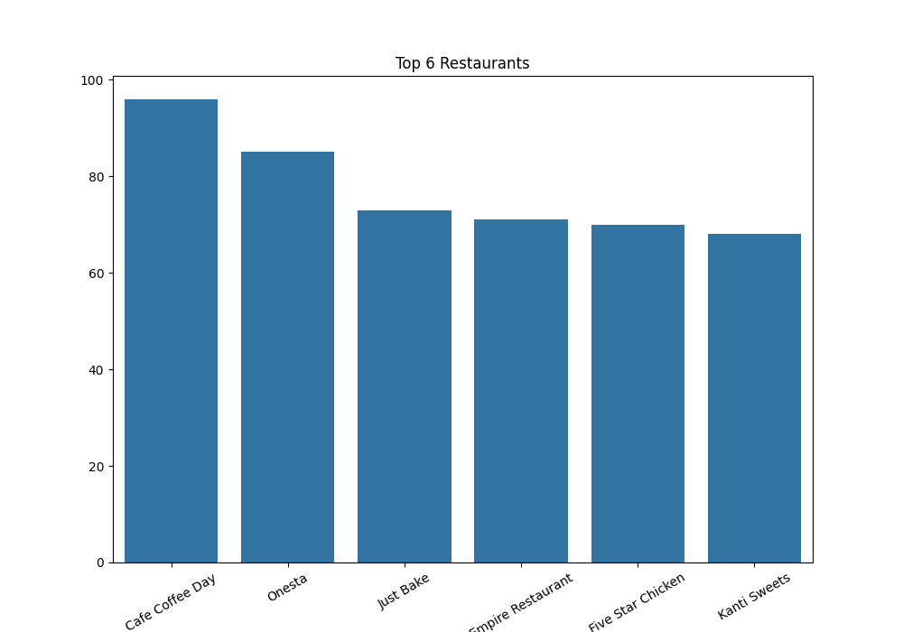
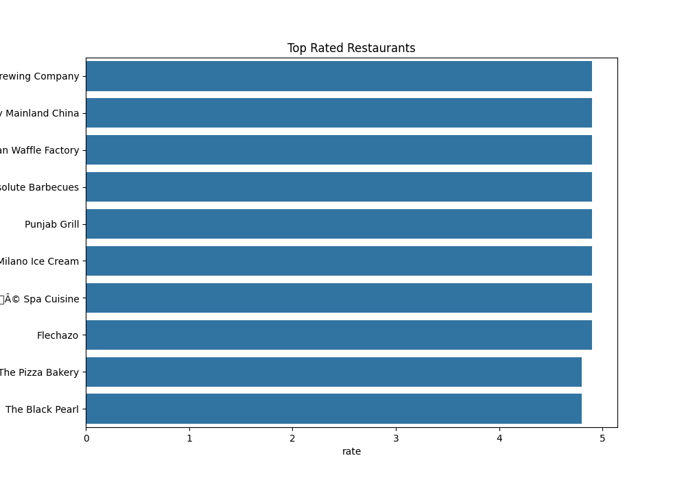
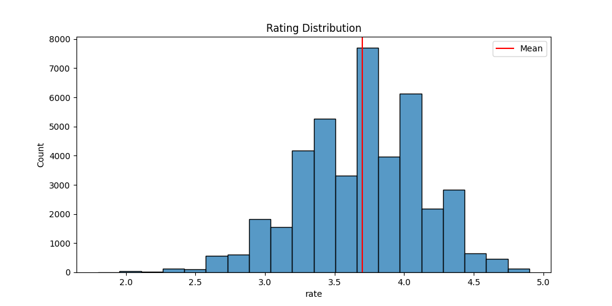
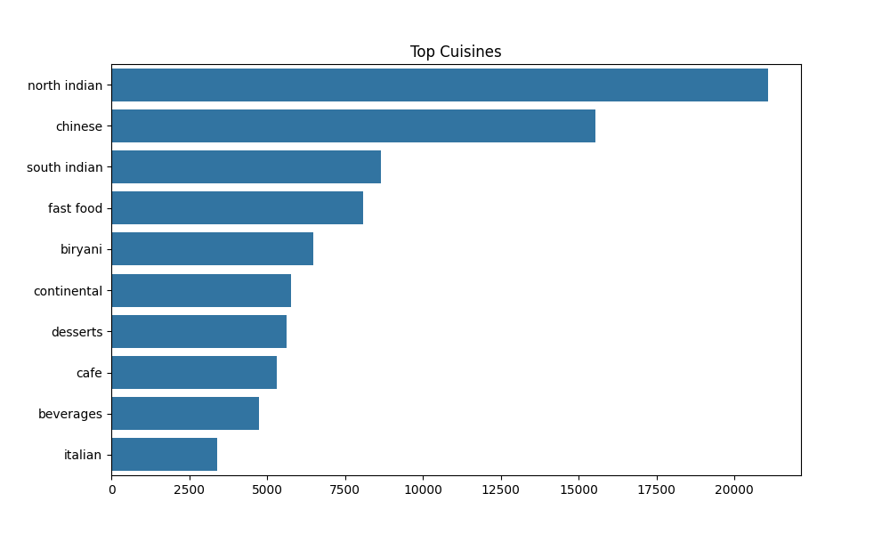

# Restaurant Recommendation System

## Project Overview

This project is a Flask-based restaurant recommendation system powered by a content-based filtering model. Users can search for a restaurant and refine recommendations using budget, rating, and cuisine preferences. The project also includes data visualizations that summarize restaurant trends from the dataset.

## Features

- Restaurant recommendations based on similarity
- Filtered results using budget, minimum rating, and cuisine
- Friendly error messages when a restaurant is not found or no filtered matches are available
- Insights page for dataset visualizations
- Popular cuisines section on the homepage

## Tech Stack

- Python
- Flask
- Scikit-learn
- Pickle
- HTML
- CSS
- Jupyter Notebook

## Screenshots

### Home Page



### Insights Page



### Dataset Visualizations




## How to Run

1. Create and activate a virtual environment.
2. Install the required packages.
3. Run the Flask app from the project root.

```bash
pip install flask scikit-learn pandas numpy matplotlib seaborn jupyter
python app.py
```

4. Open the local Flask URL in your browser.
5. Visit `/insights` to view the saved visualizations in the web app.

## Project Structure

```text
app/
  static/
    css/
    images/
  templates/
    index.html
    result.html
    insights.html
app.py
model/
  build_model.ipynb
  recommend.py
  restaurant.pkl
  tfidf.pkl
  tfidf_matrix.pkl
```

## Notes

- Visualization assets are served from `app/static/images/`.
- The notebook remains available for model building and analysis.
- The web app now exposes the charts through the `/insights` route.
